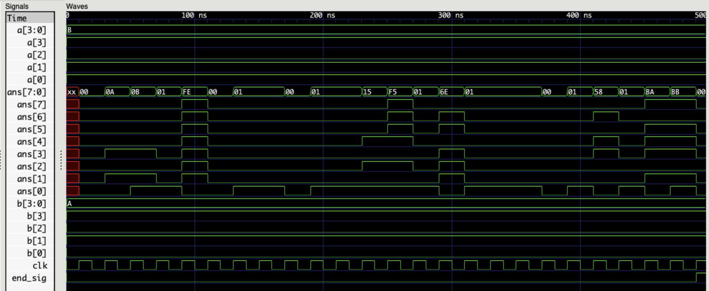
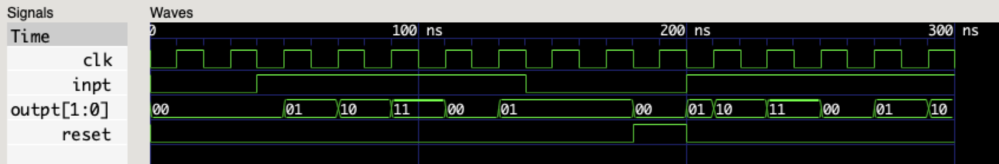

# A Verilog Review (Basics)
## Representation of digital circuits in verilog
1. ### Structural representation
    ```verilog  
    module structural_rep (a, b, c, d);
    // a, b, c, d, are called input/output PORTs
    input wire a, b, c;
    output wire d;
    wire e, f;

    not(e, a);
    xor(f, b, c);
    and(d, e, f);

    endmodule
    ```
1. ### Behavioral representation
    ```verilog  
    module structural_rep (a, b, c, d);
    input wire a, b, c;
    output wire d;
    wire e, f;

    assign d = (~a)&(b^c);

    endmodule
    ```
## Instantiation of a module
```verilog
module main (input_port1, input_port2, output_port);
// "instance1" is an instance of module "exampleModule.v"
exampleModule instance1 (input_port1, input_port2, output_port);
endmodule
```
## Structural Specificators
```verilog
not(ans, input1);
buf(ans, input1); // ans = input1 , acts as a buffer
and(ans, input1, input2, ...);
nand(ans, input1, input2, ...);
or(ans, input1, input2, ...);
nor(ans, input1, input2, ...);
xor(ans, input1, input2, ...);
xnor(ans, input1, input2, ...);
```
## Subdivisions of Behavioral Representation
1. ### Concurrent Statements :
    a continues assignment for a signal using keyword "assign".
1. ### Procedural/Sequential Statements :
    statements are evaluated by the order wich they are writen in the "always" block.
- An example of concurrent & sequential statements:
    ```verilog
    module example (input_1, input_2, concurrent_output, sequential_output);
    input wire input_1, input_2;
    output wire concurrent_output;
    // note that sequential assignments need to be registers
    output reg sequential_output;

    assign concurrent_output = input_1 & input_2;
    // same as "and(concurrent_output, input_1, input_2);"

    always@(input_1 & input_2)
        /* "always@(*)" or "always@*" could be used if you want
         the "sensitivity list" to contain all input ports*/
        sequential_output = input_1 & input_2;

    endmodule
    ```
## if / else statement
1. ### continuous assignment
   ```verilog
   module ...

   // if "condition" is true : ans = input1
   // else : ans = input2
   assign ans = condition ? input1 : input2;

   endmodule
   ```
2. ### procedural assignment
    - can be used inside "always" block:
        ```verilog
        module ...
        
        always*
        // if "condition" is true : ans = input1
        // else : ans = input2
        ans = condition ? input1 : input2;

        endmodule
        ```
    - can be written like C
        ```verilog
        module ...
        
        always*
        // if "condition" is true : ans = input1
        // else : ans = input2
        if (condition == 1'b1)
            ans = input1;
        else
            ans = input2;

        endmodule
        ```
## case statement
```verilog
    module example (a, b);
    input wire [2:0] a;
    output reg [1:0] b;

    always@(a)
        case(a)
            3'b000 : b = 2'b00;
            3'b010 : b = 2'b01;
            3'b100 : b = 2'b11;
            default : b = 2'b00;
        endcase
    endmodule
```
## a demo of some verilog operators
- code of ["example 1"](./example1.v) :
  ```verilog
    module example1 (input_port1, input_port2, output_port1, clk, end_sig);

    input wire clk;
    input wire [3:0] input_port1, input_port2;
    output reg [7:0] output_port1;
    reg [3:0] temp;
    output reg end_sig = 1'b0;

    reg [4:0] operation = 5'b00000;

    always@(posedge clk)
    begin
        if (end_sig == 1'b0)
        begin
        //reset
        output_port1 = 8'b00000000;

        case (operation)
            // 1's complement
            //5'b00000: output_port1 = ~input_port1;
            5'b00000: temp = ~input_port1;
            // bitwise AND
            5'b00001: output_port1 = input_port1 & input_port2;
            // bitwise OR
            5'b00010: output_port1 = input_port1 | input_port2;
            // bitwise XOR
            5'b00011: output_port1 = input_port1 ^ input_port2;
            // bitwise XNOR
            5'b00100: output_port1 = input_port1 ~^ input_port2;
            /* logical operators, operate on only ONE digit inputs.
             if the inputs have more than one digit,
            logical operetor, operates on digits made up by the "OR"
             of all digits of an input. */
            // logical NOT
            5'b00101: output_port1 = !input_port1;
            // logical AND
            5'b00110: output_port1 = input_port1 && input_port2;
            // logical OR
            5'b00111: output_port1 = input_port1 || input_port2;
            /* reduction operators, operate on digits of a single input */
            // reduction AND
            5'b01000: output_port1 = &input_port1;
            // reduction OR
            5'b01001: output_port1 = |input_port1;
            // reduction XOR
            5'b01010: output_port1 = ^input_port1;
            // sum
            5'b01011: output_port1 = input_port1 + input_port2;
            // 2's complement
            5'b01100: output_port1 = -input_port1;
            // subtract
            5'b01101: output_port1 = input_port1 - input_port2;
            // multiply
            5'b01110: output_port1 = input_port1 * input_port2;
            // divide
            5'b01111: output_port1 = input_port1 / input_port2;
            // grater
            5'b10000: output_port1 = input_port1 > input_port2;
            // grater or equal
            5'b10001: output_port1 = input_port1 >= input_port2;
            // equal
            5'b10010: output_port1 = input_port1 == input_port2;
            // inequal
            5'b10011: output_port1 = input_port1 != input_port2;
            // left shift
            5'b10100: output_port1 = input_port1 << 3;
            //right shift
            5'b10101: output_port1 = input_port1 >> 3;
            // concatinate
            5'b10110: output_port1 = {input_port1, input_port2};
            // replicaton
            5'b10111: output_port1 = {2{input_port1}};
            default: 
            begin 
                output_port1 = 8'b00000000;
                end_sig = 1'b1;
            end
        endcase

        operation = operation + 1'b1;
        end
    end
    endmodule
  ```
    

- results of simulating ["example1_tb.v"](./example1_tb.v) :
  
    input1 = 1011, input2 = 1010, output = 00001010, end = 0, time = 30

    input1 = 1011, input2 = 1010, output = 00001011, end = 0, time = 50

    input1 = 1011, input2 = 1010, output = 00000001, end = 0, time = 70

    input1 = 1011, input2 = 1010, output = 11111110, end = 0, time = 90

    input1 = 1011, input2 = 1010, output = 00000000, end = 0, time = 110

    input1 = 1011, input2 = 1010, output = 00000001, end = 0, time = 130

    input1 = 1011, input2 = 1010, output = 00000001, end = 0, time = 150

    input1 = 1011, input2 = 1010, output = 00000000, end = 0, time = 170

    input1 = 1011, input2 = 1010, output = 00000001, end = 0, time = 190

    input1 = 1011, input2 = 1010, output = 00000001, end = 0, time = 210

    input1 = 1011, input2 = 1010, output = 00010101, end = 0, time = 230

    input1 = 1011, input2 = 1010, output = 11110101, end = 0, time = 250

    input1 = 1011, input2 = 1010, output = 00000001, end = 0, time = 270

    input1 = 1011, input2 = 1010, output = 01101110, end = 0, time = 290

    input1 = 1011, input2 = 1010, output = 00000001, end = 0, time = 310

    input1 = 1011, input2 = 1010, output = 00000001, end = 0, time = 330

    input1 = 1011, input2 = 1010, output = 00000001, end = 0, time = 350

    input1 = 1011, input2 = 1010, output = 00000000, end = 0, time = 370

    input1 = 1011, input2 = 1010, output = 00000001, end = 0, time = 390

    input1 = 1011, input2 = 1010, output = 01011000, end = 0, time = 410

    input1 = 1011, input2 = 1010, output = 00000001, end = 0, time = 430

    input1 = 1011, input2 = 1010, output = 10111010, end = 0, time = 450

    input1 = 1011, input2 = 1010, output = 10111011, end = 0, time = 470

    input1 = 1011, input2 = 1010, output = 00000000, end = 1, time = 490

## FSM
- code of ["example2"](./example2.v):
    ```verilog
    // moor_fsm_demo
    module example2 (input_port1, output_port1, clk, reset);

    input wire input_port1;
    input wire reset, clk;
    output wire [1:0] output_port1;
    reg [1:0] state = 2'b00;

    parameter [1:0] state1 = 2'b00, state2 = 2'b01, state3 = 2'b10, state4 = 2'b11;

    always@(posedge clk, reset)
    begin
        if (reset == 1'b1)
            state = 2'b00;
        else begin
            case (state)
            // usage of "<="" instead of "=" leads to more acurate circuit represention.
            state1: state <= (input_port1 ? state2 : state1);
            state2: state <= (input_port1 ? state3 : state2);
            state3: state <= (input_port1 ? state4 : state3);
            state4: state <= (input_port1 ? state1 : state4);
            default: state <= 2'bxx;
            endcase
        end
    end

    assign output_port1 = state;

    endmodule
    ```
    
- result of simulating ["example2_tb"](./example2_tb.v):
  
    input = 0, reset =0, current state = 00, time = 0

    input = 1, reset =0, current state = 00, time = 40

    input = 1, reset =0, current state = 01, time = 50

    input = 1, reset =0, current state = 10, time = 70

    input = 1, reset =0, current state = 11, time = 90

    input = 1, reset =0, current state = 00, time = 110

    input = 1, reset =0, current state = 01, time = 130

    input = 0, reset =0, current state = 01, time = 140

    input = 0, reset =1, current state = 00, time = 180

    input = 1, reset =0, current state = 01, time = 200

    input = 1, reset =0, current state = 10, time = 210

    input = 1, reset =0, current state = 11, time = 230

    input = 1, reset =0, current state = 00, time = 250

    input = 1, reset =0, current state = 01, time = 270

    input = 1, reset =0, current state = 10, time = 290
