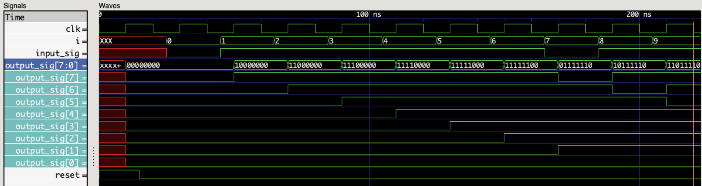

# How To Write Verilog TestBenches
## Time Scale :
``` `timescale``` specifies the time unit and it's percision.   
```verilog
`timescale 1ns/1ps
```
## include :
```verilog
`include "my_module.v"
```
## TestBench Module Defenition :
```verilog
module my_testbench ();
```
## Defining Input Regs & Output Wires :
inputs to the sub module are defined as registers because we want to change them, outputs of the sub module are connected to wires becase we only can read them.
```verilog
reg clk;
reg [3:0] inpt1;
wire [3:0] outpt1;
```
## Module Instantiation :
- uut : unit under test
- dut : design under test
    ### instantiation by order :
    ```verilog
    my_module uut (clk, inpt1, outpt1);
    ```
    ### instantiation by name :
    order is not important.
    ```verilog
    my_module uut (.clock (clk), .input1 (inpt1), .output1 (outpt1));
    ```
## Data types :
### integer :
32 bit, twos complement integer.
```verilog
integer year = 2022;
```
### real :
64 bit, IEEE, Floating point.
```verilog
real weight = 1.64;
```
### reg :
1 bit, unsigned value.
```verilog
reg a = 1'b1;
```
### parameter :
constant values, help write flexible modules, easy to reuse modules.
```verilog
parameter WIDTH = 16;
```
you can specify parameters by two methodes: 
  1. At module instantiation:
        ```verilog
        `timescale 1ns/1ps
        `include "my_module.v"
        module tb ();
        wire outpt;
        reg inpt;

        my_module #(WIDTH = 16, MEMSIZE = 1024) utt (inpt, outpt);

        endmodule
        ```
  2. With "```defparam```" , to easily update design parameters in tb module.
        ```verilog
        `timescale 1ns/1ps
        `include "my_module.v"
        module tb ();
        wire outpt;
        reg inpt;

        my_module utt (inpt, outpt);

        defparam utt.WIDTH = 16;
        defparam utt.MEMSIZE = 1024;

        endmodule
        ```
### time :
64 bit, unsigned,stores the simulation time.
```verilog
time start_time = $time;
```
### Array (reg, integer, time) :
```verilog
// 1 K bite memory:
reg [7:0] memory [0:1023];
memory [5][511] = 1'b1;
```
3D and more:
```verilog
// 1 K bite memory:
reg [7:0] memory [0:1023][0:9];
memory [511][5] = 8'b10101010;
```
### character string :
each character is stored in an 8 bit register.
```verilog
reg [5*8:1] str = "Hello";
```

## Initial blocks :
All initial blocks run simultaneously at the beginning of simulation **only once**.
```verilog
initial begin
    ...
end
```
## Taking time steps :
"#n" runs the simulation for a period of n times the time unit.
```verilog
#1
#2
#100
```
## loop statements :
### forever :
```verilog
initial begin
    forever begin
        // repeat these instruction forever.
    end
end
```
### repeat ( ) :
```verilog
initial begin
    repeat(10) begin
        // repeat these instruction 10 times.
    end
end
```
### while ( ) :
```verilog
integer x = 0;
initial begin
    while (x < 10) begin
        // repeat these instruction 10 times.
    end
end
```
### for ( ; ; ) :
```verilog
integer i;
initial begin
    for (i=0 ; i<10 ; i=i+1) begin
        // repeat these instruction 10 times.
    end
end
```
## always blocks :
```verilog
always begin
    #10 clk = ~clk;
end
```
```verilog
always @(posedge clk) begin
    ...
end
```

## methodes of generating input signals :
```verilog
initial begin
    input = 2'b00;
    #10; input = 2'b01;
    #10; input = 2'b10;
    #10; input = 2'b11;
    $finish
end
```
```verilog
integer i;
initial begin
    for (i=0; i<4 ; i=i+1) begin
        #10; input = i;
    end
    $finish
end
```
## system tasks :
### $display :
```verilog
$display("output var : %b, %b, time = %t", a, b, $time);
```
### $write :
```verilog
$display("output var : %b, %b, time = %t\n", a, b, $time);
```
### $strobe :
```verilog
initial begin
    a <= b;
    $strobe("output var : %b", a);
    $display("output var : %b", a);
end
```
### $monitor :
```verilog
initial begin
    $monitor("output var : %b", a);
end
```
### $time :
return current simulation time.
```verilog
initial begin
display($time);
end
```
### $random :
returns a random signed 32bit integer.
```verilog
reg [3:0] a = $random;
```
### $stop :
halts simulation.
```verilog
...
$stop;
end
```
### $finish :
ends simulation.\
```verilog
...
$finish;
end
```
## dump :
### $dumpfile :
name of the dump file.
```verilog
$dumpfile("tbdump.vcd");
```
### $dumpvar :
used to specify what variables are dumped.
```verilog
// dumps all variables
$dumpvars;
```
```verilog
// dumps all variables of top_tb and all variables of modules instantiated by module top_tb.
$dumpvars(0,top_tb);
```
```verilog
// only dumps all variables of top_tb.
$dumpvars(1,top_tb);
```
## Example
[example_module.v](./example3.v)  
```verilog
module example3 (input_data, parallel_output, clk, reset);

input wire input_data, clk, reset;
parameter WIDTH = 0;
output reg [WIDTH:0] parallel_output;
wire temp;
always@(posedge clk, posedge reset) begin
    if(reset == 1'b1) begin
        parallel_output = {WIDTH{1'b0}};
    end
    else begin
        parallel_output <= {input_data, parallel_output [WIDTH:1]};
    end
end

endmodule
```
[example_module_tb.v](./example3_tb.v)
```verilog
`timescale 1ns/1ns
`include "example3.v"

module example3_tb ();

reg input_sig, reset;
reg clk = 1'b0;
wire [7:0] output_sig;
integer i;

example3 uut (.input_data(input_sig), .parallel_output(output_sig), .clk(clk), .reset(reset));
defparam uut.WIDTH = 7;

initial begin
    reset = 1'b1;
    #15;
    reset = 1'b0;
    #10;
    for(i=0 ; i<10 ; i=i+1) begin
        input_sig = $random;
        $display("input signal = %b, output_signal = %b, time = %t", input_sig, output_sig, $time);
        #20;
    end
    $finish;
end

initial begin
    $dumpfile("example3_out.vcd");
    $dumpvars;
end

always begin
    #10; clk = ~clk;
end

endmodule
```
    
example output :
```
input signal = 0, output_signal = 00000000, time =                   25
input signal = 1, output_signal = 00000000, time =                   45
input signal = 1, output_signal = 10000000, time =                   65
input signal = 1, output_signal = 11000000, time =                   85
input signal = 1, output_signal = 11100000, time =                  105
input signal = 1, output_signal = 11110000, time =                  125
input signal = 1, output_signal = 11111000, time =                  145
input signal = 0, output_signal = 11111100, time =                  165
input signal = 1, output_signal = 01111110, time =                  185
input signal = 1, output_signal = 10111110, time =                  205
```
## references:
1. https://www.chipverify.com/verilog/verilog-tutorial
2. https://verilogguide.readthedocs.io/en/latest/index.html
3. http://www.referencedesigner.com/tutorials/verilog/verilog_62.php
4. https://uobdv.github.io/Design-Verification/FAQs/random
5. https://verificationacademy.com/forums/systemverilog/time-vs-realtime
6. http://www.referencedesigner.com/tutorials/verilog/verilog_09.php
7. http://electrosofts.com/verilog/loop_statements.html
8. https://youtube.com/playlist?list=PLUtfVcb-iqn-EkuBs3arreilxa2UKIChl
9. https://www.youtube.com/watch?v=VrqwXXSjZME
10. https://www.youtube.com/watch?v=-Kdbzax9EOQ
11. https://www.youtube.com/watch?v=Urvo2C_mniI&t=1135s
